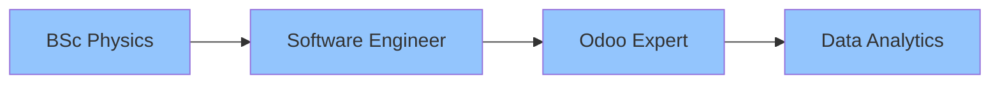

<div align="center">


# 👨‍💻 Chamal Ruwanjith

[](https://git.io/typing-svg)

<p align="center">
  <a href="https://chamalruwanjith.github.io">
    
  </a>
  <a href="https://www.linkedin.com/in/chamalruwanjith">
    
  </a>
  <a href="mailto:chamalruwanjith@gmail.com">
    
  </a>
</p>

<a href="https://github.com/chamalruwanjith?tab=followers">
  
</a>
<a href="https://github.com/chamalruwanjith?tab=repositories&sort=stargazers">
  
</a>

</div>

## 🎯 Current Focus

```python
class SoftwareEngineer:
    def __init__(self):
        self.name = "Chamal Ruwanjith"
        self.role = "Software Engineer"
        self.language_spoken = ["si_LK", "en_US"]
        self.current_focus = ["Odoo Development", "Data Analytics", "Machine Learning"]
    
    def say_hi(self):
        print("Thanks for dropping by! Let's create something amazing together!")

me = SoftwareEngineer()
me.say_hi()
```

## 🚀 Tech Universe

### 🛠️ Languages & Development
<p align="left">


</p>

### 🌐 Web Technologies
<p align="left">


</p>

### 🗄️ Databases & Cloud
<p align="left">


</p>

### 🛠️ Tools & Platforms
<p align="left">


</p>

### 📊 Data Science & Analytics
<p align="left">


</p>

## 💼 Professional Journey



## 🎯 Featured Projects

<table>
  <tr>
    <td width="50%">
      <h3 align="center">Multi-Company Inventory Management</h3>
      <div align="center">
        
        
        
        <p>Advanced Odoo module managing cross-company inventory with real-time synchronization</p>
      </div>
    </td>
    <td width="50%">
      <h3 align="center">Smart Wheelchair System</h3>
      <div align="center">
        
        
        <p>Head-motion controlled wheelchair system for enhanced mobility</p>
      </div>
    </td>
  </tr>
</table>

## 📊 GitHub Analytics

<div align="center">
   <br><br>
  
  
  
  
  
</div>

## 🎓 Education & Certifications

```javascript
const education = {
  degrees: [
    {
      degree: "Master of Data Analytics",
      institution: "University of Kelaniya",
      period: "2022 - Present"
    },
    {
      degree: "B.Sc. (Hons) in Physics",
      institution: "University of Sri Jayewardenepura",
      period: "2017 - 2021"
    }
  ],
  certifications: [
    "Data Science with Python - University of Colombo",
    "Advanced Databases and SQL Querying - Udemy",
    "Google Data Analytics Certificates"
  ]
};
```

## 📈 Coding Activity

<!--START_SECTION:waka-->
```text
Python       ███████████░░░░░░░░   45.50 %
SQL          ████████░░░░░░░░░░░   30.20 %
JavaScript   ████░░░░░░░░░░░░░░░   15.30 %
HTML/CSS     ███░░░░░░░░░░░░░░░░   09.00 %
```
<!--END_SECTION:waka-->

---

<div align="center">
   <br/>
  
  ### 💬 _"Code is like humor. When you have to explain it, it's bad."_ – Cory House

  
</div>
